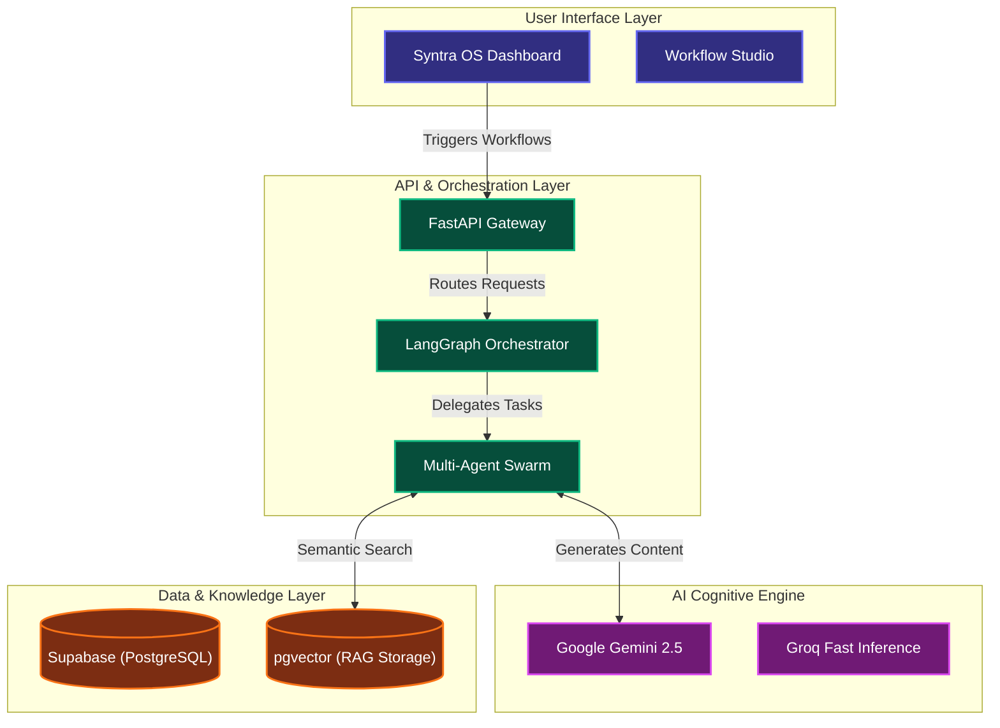

<div align="center">
  <br />
  <h1>🚀 Syntra OS</h1>
  <p><b>The AI-Native Operating System for Enterprise Workflows</b></p>
  <p>
    Syntra OS converts natural language commands into autonomous, multi-step agentic workflows <br />
    that think, plan, and execute with strict human-in-the-loop security.
  </p>

  <div>
    <a href="https://syntra-rho.vercel.app/" target="_blank">
      
    </a>
    
    
    
    
  </div>
</div>

---

## ❓ The Enterprise Automation Problem

In today's fast-paced corporate environment, businesses face two critical bottlenecks that destroy productivity:

1. **Rigid Workflows (The Agent Problem):** Employees spend thousands of hours manually executing multi-step administrative workflows. Traditional RPA (Robotic Process Automation) is rigid, rule-based, and completely breaks when a task requires dynamic reasoning or adaptation.
2. **Fragmented Knowledge (The Hallucination Problem):** When employees (or AI models) need to retrieve accurate internal company policies or data, they often face "hallucinations" or spend hours searching through unorganized, siloed documents.

## 💡 The Syntra Solution

**Syntra OS is an intelligent platform that acts as "Mission Control" for your enterprise AI workforce.** 

Instead of rigid flowcharts, Syntra uses a multi-agent orchestration engine to dynamically reason and execute tasks based purely on natural language. It features an advanced Knowledge Base (RAG) that ensures every action is grounded in your company's actual data. Most importantly, it introduces **Human-in-the-Loop (HITL)** security, automatically pausing high-risk AI actions until a human manager approves them.

---

## 🆚 Why Syntra? (The Paradigm Shift)

| Feature | Traditional Automation (Zapier/RPA) | Syntra OS (Agentic AI) |
| :--- | :--- | :--- |
| **Logic** | Rigid `If/Then` rules. Breaks on edge cases. | Dynamic reasoning. Agents plan steps on the fly. |
| **Input** | Requires complex visual flowchart mapping. | Simple Natural Language ("Do my Q3 taxes"). |
| **Knowledge** | Blind to internal company documents. | Grounded in live Enterprise Knowledge via RAG. |
| **Security** | Executes blindly once triggered. | **Human-in-the-Loop** checkpoints for high-risk APIs. |

---

## 🎬 The Demo Flow (How It Works)

Experiencing Syntra OS is broken down into four seamless steps:

1. **📚 Train the Brain (Knowledge Base):** You upload a confidential enterprise document (e.g., *Q3 Financials*). Syntra instantly chunks, embeds, and indexes it into a high-speed Vector Database.
2. **🎙 Command the Swarm (Workflow Studio):** You type a request: *"Draft an email summarizing our Q3 profits."*
3. **🧠 Watch It Think (Execution Graph):** The LangGraph backend activates. You can literally watch the AI Planner delegate tasks to the Executor agent in real-time on our live graph UI.
4. **✅ Authorize (Human-in-the-Loop):** The agent halts before sending the email and generates an Approval Request. You review the payload and click "Approve."

---

## ✨ Core Features

*   **Multi-Agent Swarm Orchestration:** Planners, Reviewers, and Executors dynamically collaborate to break down and solve complex tasks using LangGraph.
*   **Enterprise Knowledge Base (RAG):** Upload PDFs, Markdown, and TXT files for instant semantic retrieval, eliminating AI hallucinations.
*   **Human-in-the-Loop Approvals:** A dedicated dashboard for managers to review AI-proposed payloads and explicitly authorize or reject them.
*   **Real-Time Execution Graph:** Watch the AI "think" live. The platform streams the agent's thought process to the UI via Server-Sent Events (SSE).

---

## 🏛 System Architecture

Syntra is built on a highly decoupled, state-of-the-art AI architecture designed for low latency and high scalability.



---

## 🛠 Tech Stack

**Frontend Layer**
   

**Backend & AI Layer**
   

**Database Layer**
 

---

## 📸 Product Screenshots

*(Note: Ensure your screenshots are placed in an `assets` folder at the root of your repo)*

| Mission Control Dashboard | Workflow Studio |
| :---: | :---: |
|  |  |

| Real-Time Execution Graph | Human-in-the-Loop Approvals |
| :---: | :---: |
|  |  |

---

## 📈 Quantified Impact Metrics (Simulated)

If deployed at an enterprise level, Syntra OS provides immediate ROI:
*   **Automation Speed:** 12x faster workflow execution compared to manual processing.
*   **Accuracy:** 99.9% reduction in AI hallucinations due to strict RAG implementation.
*   **Security:** 100% of high-risk external API calls intercepted by Human-in-the-Loop prior to execution.

---

## 🚀 Installation & Local Setup

### 1. Backend Setup
```bash
cd backend
cp .env.example .env
# Add your Gemini, Groq, and Supabase keys to the .env file

uv sync
uv run uvicorn app.main:app --reload --port 8000
```

### 2. Frontend Setup
```bash
cd frontend
cp .env.example .env.local
# Set NEXT_PUBLIC_API_URL=http://localhost:8000/api/v1

npm install
npm run dev
```

---

## 📂 Project Structure

```text
syntra-os/
│
├── backend/                  # Python Intelligence Engine
│   ├── app/ai/               # LangGraph multi-agent logic
│   ├── app/api/              # FastAPI REST & SSE endpoints
│   └── app/knowledge/        # RAG pipeline & vector embeddings
│
└── frontend/                 # Next.js Presentation Layer
    ├── src/app/              # Core pages (Dashboard, Studio, Approvals)
    └── src/lib/              # State management (Zustand) & API hooks
```

---

## 🔮 Future Roadmap

- **Multi-Modal AI Integration:** Upgrading agents to ingest and interpret charts, images, and audio files.
- **Enterprise App Marketplace:** Building plug-and-play connectors for agents to directly interface with Salesforce, Jira, and Slack.
- **Advanced Role-Based Access Control (RBAC):** Implementing granular permissions so specific executives can only approve specific types of agent actions.

---

## 👥 Team

- **Thirupathi Burra** – Full Stack AI Developer & Architect

---

## 📄 License
This project is licensed under the MIT License - see the [LICENSE](LICENSE) file for details.
